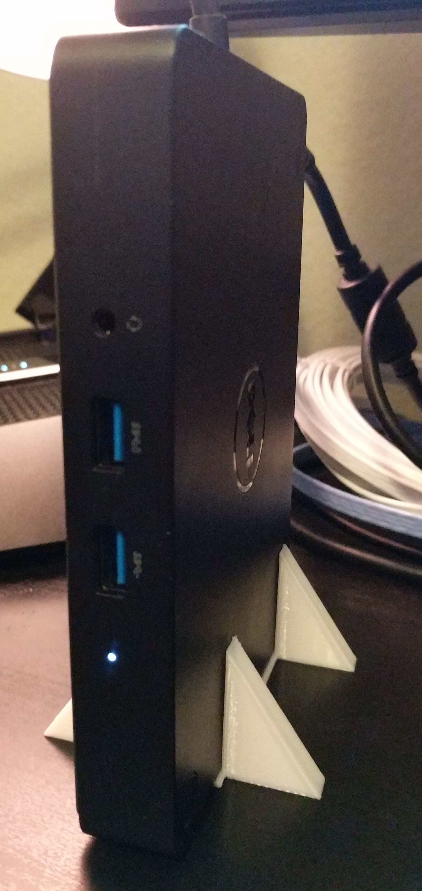

# K17A Vertical Stand

This is a basic vertical stand for the Dell K17A Docking station I use at work.  
Feel free to adapt and use for your own purposes.  
  
You can download and print the STL file directly, or edit the .scad file in OpenSCAD to make changes.
  
Here's a terrible picture:  

